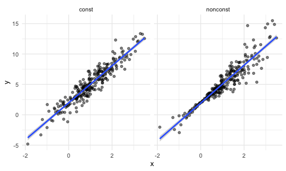
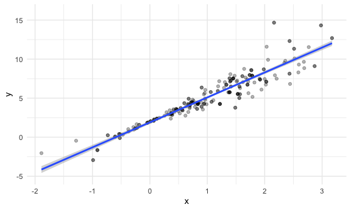
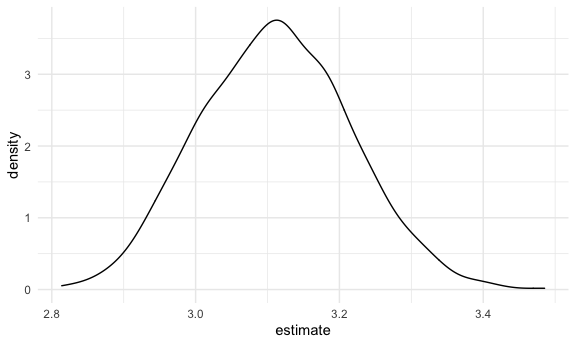

Bootstrapping
================

## Simulate data

``` r
n_samp = 250

sim_df_const = 
  tibble(
    x = rnorm(n_samp, 1, 1),
    error = rnorm(n_samp, 0, 1),
    y = 2 + 3 * x + error
  )

sim_df_nonconst = sim_df_const %>% 
  mutate(
  error = error * .75 * x,
  y = 2 + 3 * x + error
)
```

Plot the datasets.

``` r
sim_df = 
  bind_rows(const = sim_df_const, nonconst = sim_df_nonconst, .id = "data_source") 

sim_df %>% 
  ggplot(aes(x = x, y = y)) + 
  geom_point(alpha = .5) +
  stat_smooth(method = "lm") +
  facet_grid(~data_source) 
```

    ## `geom_smooth()` using formula 'y ~ x'



``` r
lm(y ~ x, data = sim_df_const) %>% 
  broom::tidy() %>% 
  knitr::kable(digits = 3)
```

| term        | estimate | std.error | statistic | p.value |
| :---------- | -------: | --------: | --------: | ------: |
| (Intercept) |    1.977 |     0.098 |    20.157 |       0 |
| x           |    3.045 |     0.070 |    43.537 |       0 |

``` r
lm(y ~ x, data = sim_df_nonconst) %>% 
  broom::tidy() %>% 
  knitr::kable(digits = 3)
```

| term        | estimate | std.error | statistic | p.value |
| :---------- | -------: | --------: | --------: | ------: |
| (Intercept) |    1.934 |     0.105 |    18.456 |       0 |
| x           |    3.112 |     0.075 |    41.661 |       0 |

## Draw on bootstrap sample

``` r
boot_sample = function(df) {
  
  sample_frac(df, replace = TRUE) %>% 
    arrange(x)
  
}
```

why do we want to draw the same size ? because confidence interval/
variance estimate are really dependent on sample size. we want to mimic
the uncertainty in the dataset, with replacement, but remain the sample
size the same.

check if this works…

``` r
boot_sample(sim_df_nonconst) %>% 
  ggplot(aes(x = x, y = y)) + 
  geom_point(alpha = .3) +
  stat_smooth(method = "lm") +
  ylim(-5 ,16)
```

    ## `geom_smooth()` using formula 'y ~ x'



``` r
boot_sample(sim_df_nonconst) %>% 
  lm(y ~ x, data = .) %>% 
  broom::tidy()
```

    ## # A tibble: 2 x 5
    ##   term        estimate std.error statistic   p.value
    ##   <chr>          <dbl>     <dbl>     <dbl>     <dbl>
    ## 1 (Intercept)     1.90    0.0982      19.3 2.45e- 51
    ## 2 x               3.14    0.0688      45.6 1.18e-122

## Many samples and analysis

``` r
boot_straps = 
  data_frame(
    strap_number = 1:1000,
    strap_sample = rerun(1000, boot_sample(sim_df_nonconst))
  )
```

    ## Warning: `data_frame()` is deprecated as of tibble 1.1.0.
    ## Please use `tibble()` instead.
    ## This warning is displayed once every 8 hours.
    ## Call `lifecycle::last_warnings()` to see where this warning was generated.

``` r
#or

boot_straps = 
  tibble(
    strap_number = 1:1000,
    strap_sample = rerun(1000, boot_sample(sim_df_nonconst))
  )

boot_straps
```

    ## # A tibble: 1,000 x 2
    ##    strap_number strap_sample      
    ##           <int> <list>            
    ##  1            1 <tibble [250 × 3]>
    ##  2            2 <tibble [250 × 3]>
    ##  3            3 <tibble [250 × 3]>
    ##  4            4 <tibble [250 × 3]>
    ##  5            5 <tibble [250 × 3]>
    ##  6            6 <tibble [250 × 3]>
    ##  7            7 <tibble [250 × 3]>
    ##  8            8 <tibble [250 × 3]>
    ##  9            9 <tibble [250 × 3]>
    ## 10           10 <tibble [250 × 3]>
    ## # … with 990 more rows

Can I run my analysis on these…?

``` r
boot_results =
  boot_straps %>% 
  mutate(
    models = map(.x = strap_sample, ~lm(y ~ x, data = .x)),
    results = map(models, broom::tidy)
  ) %>% 
  select(strap_number, results) %>% 
  unnest(results)
  
boot_results
```

    ## # A tibble: 2,000 x 6
    ##    strap_number term        estimate std.error statistic   p.value
    ##           <int> <chr>          <dbl>     <dbl>     <dbl>     <dbl>
    ##  1            1 (Intercept)     1.90    0.101       18.8 1.05e- 49
    ##  2            1 x               3.11    0.0774      40.2 1.27e-110
    ##  3            2 (Intercept)     1.87    0.0944      19.8 5.17e- 53
    ##  4            2 x               3.24    0.0667      48.6 1.13e-128
    ##  5            3 (Intercept)     2.01    0.115       17.5 2.87e- 45
    ##  6            3 x               2.96    0.0776      38.1 1.38e-105
    ##  7            4 (Intercept)     1.91    0.114       16.7 1.31e- 42
    ##  8            4 x               3.12    0.0818      38.1 1.03e-105
    ##  9            5 (Intercept)     1.92    0.109       17.7 8.68e- 46
    ## 10            5 x               3.05    0.0748      40.8 4.45e-112
    ## # … with 1,990 more rows

What do I have now?

``` r
boot_results %>% 
  group_by(term) %>% 
  summarize(
    mean_est = mean(estimate),
    se_est = sd(estimate))
```

    ## `summarise()` ungrouping output (override with `.groups` argument)

    ## # A tibble: 2 x 3
    ##   term        mean_est se_est
    ##   <chr>          <dbl>  <dbl>
    ## 1 (Intercept)     1.93 0.0762
    ## 2 x               3.11 0.104

Look at the distributions

``` r
boot_results %>% 
  filter(term == "x") %>% 
  ggplot(aes(x = estimate)) +
  geom_density()
```



construct bootstrap CI

``` r
boot_results %>% 
  group_by(term) %>% 
  summarize(
    ci_lower = quantile(estimate, 0.025), 
    ci_upper = quantile(estimate, 0.975))
```

    ## `summarise()` ungrouping output (override with `.groups` argument)

    ## # A tibble: 2 x 3
    ##   term        ci_lower ci_upper
    ##   <chr>          <dbl>    <dbl>
    ## 1 (Intercept)     1.79     2.08
    ## 2 x               2.92     3.32

## Bootstrap using modelr

Can we simplify anything …?

``` r
sim_df_nonconst %>% 
  bootstrap(1000, id = "strap_number") %>% 
  mutate(
    models = map(.x = strap, ~lm(y ~ x, data = .x)),
    results = map(models, broom::tidy)
  ) %>% 
  select(strap_number, results) %>% 
  unnest(results) %>% 
  group_by(term) %>% 
  summarize(
    mean_est = mean(estimate),
    se_est = sd(estimate))
```

    ## `summarise()` ungrouping output (override with `.groups` argument)

    ## # A tibble: 2 x 3
    ##   term        mean_est se_est
    ##   <chr>          <dbl>  <dbl>
    ## 1 (Intercept)     1.93 0.0793
    ## 2 x               3.11 0.104
