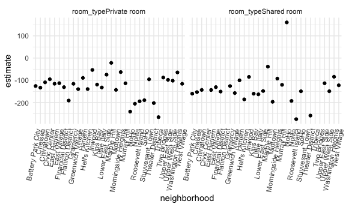

Linear Models
================

## Import data

``` r
data("nyc_airbnb")

nyc_airbnb = 
  nyc_airbnb %>% 
  mutate(stars = review_scores_location / 2) %>% 
  rename(
    borough = neighbourhood_group,
    neighborhood = neighbourhood) %>% 
  filter(borough != "Staten Island") %>% 
  select(price, stars, borough, neighborhood, room_type)
```

## Fit a model

``` r
nyc_airbnb %>% 
  ggplot(aes(x = stars, y = price, color = borough)) +
  geom_point()
```

    ## Warning: Removed 9962 rows containing missing values (geom_point).


Let’s fit the model we care about.

``` r
fit = lm(price ~ stars + borough, data = nyc_airbnb)
```

Let’s look at the result.

Let’s look at the result better ..

``` r
broom::glance(fit)
```

    ## # A tibble: 1 x 12
    ##   r.squared adj.r.squared sigma statistic   p.value    df  logLik    AIC    BIC
    ##       <dbl>         <dbl> <dbl>     <dbl>     <dbl> <dbl>   <dbl>  <dbl>  <dbl>
    ## 1    0.0342        0.0341  182.      271. 6.73e-229     4 -2.02e5 4.04e5 4.04e5
    ## # … with 3 more variables: deviance <dbl>, df.residual <int>, nobs <int>

``` r
broom::tidy(fit) %>% 
  select(-std.error, -statistic) %>% 
  mutate(term = str_replace(term, "^borough", "Borough: ")) %>% 
  knitr::kable(digits = 3)
```

| term               | estimate | p.value |
| :----------------- | -------: | ------: |
| (Intercept)        | \-70.414 |   0.000 |
| stars              |   31.990 |   0.000 |
| Borough: Brooklyn  |   40.500 |   0.000 |
| Borough: Manhattan |   90.254 |   0.000 |
| Borough: Queens    |   13.206 |   0.145 |

## Be in control of factors

``` r
nyc_airbnb = 
  nyc_airbnb %>% 
  mutate(
    borough = fct_infreq(borough),
    room_type = fct_infreq(room_type))
```

Look at that plot again

``` r
nyc_airbnb %>% 
  ggplot(aes(x = stars, y = price, color = borough)) +
  geom_point()
```

    ## Warning: Removed 9962 rows containing missing values (geom_point).


``` r
fit = lm(price ~ stars + borough, data = nyc_airbnb)

broom::tidy(fit)
```

    ## # A tibble: 5 x 5
    ##   term            estimate std.error statistic   p.value
    ##   <chr>              <dbl>     <dbl>     <dbl>     <dbl>
    ## 1 (Intercept)         19.8     12.2       1.63 1.04e-  1
    ## 2 stars               32.0      2.53     12.7  1.27e- 36
    ## 3 boroughBrooklyn    -49.8      2.23    -22.3  6.32e-109
    ## 4 boroughQueens      -77.0      3.73    -20.7  2.58e- 94
    ## 5 boroughBronx       -90.3      8.57    -10.5  6.64e- 26

``` r
broom::glance(fit)
```

    ## # A tibble: 1 x 12
    ##   r.squared adj.r.squared sigma statistic   p.value    df  logLik    AIC    BIC
    ##       <dbl>         <dbl> <dbl>     <dbl>     <dbl> <dbl>   <dbl>  <dbl>  <dbl>
    ## 1    0.0342        0.0341  182.      271. 6.73e-229     4 -2.02e5 4.04e5 4.04e5
    ## # … with 3 more variables: deviance <dbl>, df.residual <int>, nobs <int>

## Diagnostics

``` r
nyc_airbnb %>% 
  modelr::add_residuals(fit) %>% 
  ggplot(aes(x = borough, y = resid)) + 
  geom_violin() +
  ylim(-500, 1500)
```

    ## Warning: Removed 9993 rows containing non-finite values (stat_ydensity).


``` r
nyc_airbnb %>% 
  modelr::add_residuals(fit) %>% 
  ggplot(aes(x = stars, y = resid)) + 
  geom_point() +
  facet_wrap(. ~ borough)
```

    ## Warning: Removed 9962 rows containing missing values (geom_point).


## Hypothesis tests

This does t-test by default

``` r
fit %>% 
  broom::tidy()
```

    ## # A tibble: 5 x 5
    ##   term            estimate std.error statistic   p.value
    ##   <chr>              <dbl>     <dbl>     <dbl>     <dbl>
    ## 1 (Intercept)         19.8     12.2       1.63 1.04e-  1
    ## 2 stars               32.0      2.53     12.7  1.27e- 36
    ## 3 boroughBrooklyn    -49.8      2.23    -22.3  6.32e-109
    ## 4 boroughQueens      -77.0      3.73    -20.7  2.58e- 94
    ## 5 boroughBronx       -90.3      8.57    -10.5  6.64e- 26

what about the significance of ‘borough’

``` r
fit_null = lm(price ~ stars + borough, data = nyc_airbnb)
fit_alt = lm(price ~ stars + borough + room_type, data = nyc_airbnb)


anova(fit_null, fit_alt) %>% 
  broom::tidy()
```

    ## # A tibble: 2 x 6
    ##   res.df         rss    df     sumsq statistic p.value
    ##    <dbl>       <dbl> <dbl>     <dbl>     <dbl>   <dbl>
    ## 1  30525 1005601724.    NA       NA        NA       NA
    ## 2  30523  921447496.     2 84154228.     1394.       0

## Nest data, fit models

interactions: slope on stars, interaction term between star and borough.
how stars affect prices in this borough compared to another borough.
This is pretty formal and also complex.

``` r
fit = lm(price ~ stars * borough + room_type * borough, data = nyc_airbnb)
broom::tidy(fit)
```

    ## # A tibble: 16 x 5
    ##    term                                  estimate std.error statistic  p.value
    ##    <chr>                                    <dbl>     <dbl>     <dbl>    <dbl>
    ##  1 (Intercept)                              95.7      19.2     4.99   6.13e- 7
    ##  2 stars                                    27.1       3.96    6.84   8.20e-12
    ##  3 boroughBrooklyn                         -26.1      25.1    -1.04   2.99e- 1
    ##  4 boroughQueens                            -4.12     40.7    -0.101  9.19e- 1
    ##  5 boroughBronx                             -5.63     77.8    -0.0723 9.42e- 1
    ##  6 room_typePrivate room                  -124.        3.00  -41.5    0.      
    ##  7 room_typeShared room                   -154.        8.69  -17.7    1.42e-69
    ##  8 stars:boroughBrooklyn                    -6.14      5.24   -1.17   2.41e- 1
    ##  9 stars:boroughQueens                     -17.5       8.54   -2.04   4.09e- 2
    ## 10 stars:boroughBronx                      -22.7      17.1    -1.33   1.85e- 1
    ## 11 boroughBrooklyn:room_typePrivate room    32.0       4.33    7.39   1.55e-13
    ## 12 boroughQueens:room_typePrivate room      54.9       7.46    7.37   1.81e-13
    ## 13 boroughBronx:room_typePrivate room       71.3      18.0     3.96   7.54e- 5
    ## 14 boroughBrooklyn:room_typeShared room     47.8      13.9     3.44   5.83e- 4
    ## 15 boroughQueens:room_typeShared room       58.7      17.9     3.28   1.05e- 3
    ## 16 boroughBronx:room_typeShared room        83.1      42.5     1.96   5.03e- 2

``` r
nyc_airbnb %>% 
  lm(price ~ stars * borough + room_type * borough, data = .) %>% 
  broom::tidy() %>% 
  knitr::kable(digits = 3)
```

| term                                   |  estimate | std.error | statistic | p.value |
| :------------------------------------- | --------: | --------: | --------: | ------: |
| (Intercept)                            |    95.694 |    19.184 |     4.988 |   0.000 |
| stars                                  |    27.110 |     3.965 |     6.838 |   0.000 |
| boroughBrooklyn                        |  \-26.066 |    25.080 |   \-1.039 |   0.299 |
| boroughQueens                          |   \-4.118 |    40.674 |   \-0.101 |   0.919 |
| boroughBronx                           |   \-5.627 |    77.808 |   \-0.072 |   0.942 |
| room\_typePrivate room                 | \-124.188 |     2.996 |  \-41.457 |   0.000 |
| room\_typeShared room                  | \-153.635 |     8.692 |  \-17.676 |   0.000 |
| stars:boroughBrooklyn                  |   \-6.139 |     5.237 |   \-1.172 |   0.241 |
| stars:boroughQueens                    |  \-17.455 |     8.539 |   \-2.044 |   0.041 |
| stars:boroughBronx                     |  \-22.664 |    17.099 |   \-1.325 |   0.185 |
| boroughBrooklyn:room\_typePrivate room |    31.965 |     4.328 |     7.386 |   0.000 |
| boroughQueens:room\_typePrivate room   |    54.933 |     7.459 |     7.365 |   0.000 |
| boroughBronx:room\_typePrivate room    |    71.273 |    18.002 |     3.959 |   0.000 |
| boroughBrooklyn:room\_typeShared room  |    47.797 |    13.895 |     3.440 |   0.001 |
| boroughQueens:room\_typeShared room    |    58.662 |    17.897 |     3.278 |   0.001 |
| boroughBronx:room\_typeShared room     |    83.089 |    42.451 |     1.957 |   0.050 |

This is more exploratory but maybe easier to understand.

``` r
nyc_airbnb %>% 
  nest(data = -borough) %>% 
  mutate(
    models = map(.x = data, ~lm(price ~ stars, data = .x)),
    results = map(models, broom::tidy)) %>% 
  select(-data, -models) %>% 
  unnest(results) %>% 
  filter(term == "stars")
```

    ## # A tibble: 4 x 6
    ##   borough   term  estimate std.error statistic  p.value
    ##   <fct>     <chr>    <dbl>     <dbl>     <dbl>    <dbl>
    ## 1 Bronx     stars     4.91      4.10      1.20 2.31e- 1
    ## 2 Queens    stars    15.8       5.63      2.81 5.06e- 3
    ## 3 Brooklyn  stars    28.0       3.10      9.02 2.13e-19
    ## 4 Manhattan stars    43.3       4.78      9.07 1.39e-19

``` r
nyc_airbnb %>% 
  nest(data = -borough) %>% 
  mutate(
    models = map(data, ~lm(price ~ stars + room_type, data = .x)),
    results = map(models, broom::tidy)) %>% 
  select(-data, -models) %>% 
  unnest(results) %>% 
  filter(term != "(Intercept)") %>% 
  select(borough, term, estimate) %>% 
  pivot_wider(
    names_from = borough, 
    values_from = estimate) %>% 
  knitr::kable(digits = 3)
```

| term                   |    Bronx |   Queens |  Brooklyn | Manhattan |
| :--------------------- | -------: | -------: | --------: | --------: |
| stars                  |    4.446 |    9.654 |    20.971 |    27.110 |
| room\_typePrivate room | \-52.915 | \-69.255 |  \-92.223 | \-124.188 |
| room\_typeShared room  | \-70.547 | \-94.973 | \-105.839 | \-153.635 |

Let’s nest even more…

``` r
manhattan_airbnb =
  nyc_airbnb %>% 
  filter(borough == "Manhattan")

manhattan_nest_lm_res =
  manhattan_airbnb %>% 
  nest(data = -neighborhood) %>% 
  mutate(
    models = map(.x = data, ~lm(price ~ stars + room_type, data = .x)),
    results = map(models, broom::tidy)) %>% 
  select(-data, -models) %>% 
  unnest(results)

manhattan_nest_lm_res
```

    ## # A tibble: 123 x 6
    ##    neighborhood      term                  estimate std.error statistic  p.value
    ##    <chr>             <chr>                    <dbl>     <dbl>     <dbl>    <dbl>
    ##  1 Battery Park City (Intercept)             -119.      366.     -0.324 7.48e- 1
    ##  2 Battery Park City stars                     74.0      74.2     0.997 3.27e- 1
    ##  3 Battery Park City room_typePrivate room   -126.       27.6    -4.56  8.11e- 5
    ##  4 Battery Park City room_typeShared room    -160.       56.3    -2.84  7.96e- 3
    ##  5 Chinatown         (Intercept)              337.       60.4     5.59  5.66e- 8
    ##  6 Chinatown         stars                    -27.8      13.0    -2.14  3.34e- 2
    ##  7 Chinatown         room_typePrivate room   -109.       11.5    -9.52  1.03e-18
    ##  8 Chinatown         room_typeShared room    -143.       93.2    -1.54  1.25e- 1
    ##  9 Chelsea           (Intercept)              477.      135.      3.53  4.38e- 4
    ## 10 Chelsea           stars                    -44.5      27.3    -1.63  1.04e- 1
    ## # … with 113 more rows

``` r
manhattan_nest_lm_res %>% 
  filter(str_detect(term, "room_type")) %>% 
  ggplot(aes(x = neighborhood, y = estimate)) + 
  geom_point() + 
  facet_wrap(~term) + 
  theme(axis.text.x = element_text(angle = 80, hjust = 1))
```


